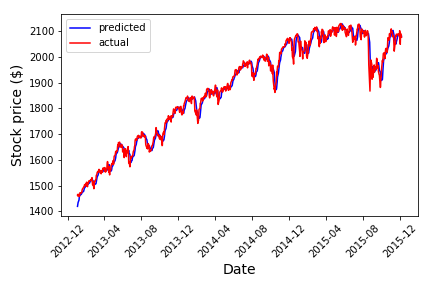

## Stock price with machine learning



- Cleaned a stock price dataset from the S&P500 Index, engineered the features, used linear regression model to predict the stock price  
- Technologies: Python Pandas, Matplotlib, Numpy, Scikit Learn, Linear Regression Model


```python

```
